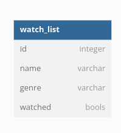

## Workshp part-3

- First all the attendes have to go through the basic installation of postgress, which is define in [Postgres_initial_configuration.md](https://github.com/Improwised/lnpp-workshop/blob/main/Postgres/Postgres_initial_configuration.md) file


## Basic Introduction
- We will create a basic table, and perform crud operation on that table
- We will use only psql

## Let's start our psql commands

### Command 0
log in to psql in terminal (Not needed if alrady logged in)
```
sudo -i -u username
```

create database watch_time
```
createdb watch_time
```

connect to that database using psql
```
psql -d watch_time
```
<br/>

### Command 1
We want to create table name as watch_list, it contains following properties<br/><br/>
<br/><br/>
So, This is syntax for creating a table in PostgreSQL
- serial will act as auto increment column
```
CREATE TABLE watch_list (
  id SERIAL,
  name VARCHAR(255),
  genre VARCHAR(255),
  watched BOOLEAN
);
```
<br/>

### Command 2: Insertion
Now let's add some data to our watch_time
```
INSERT INTO watch_list (name, genre, watched)
VALUES ('Pirates of The Carrabian', 'Adventure', FALSE);
```
<br/>

### Command 3: Updation
Let's watch some movies
```
UPDATE watch_list
SET watched=TRUE
WHERE name='Pirates of The Carrabian';
```
<br/>

### Command 4: Selection
Select is basic simple query
```
SELECT * FROM watch_list;
```
or try this
```
SELECT count(name),genre FROM watch_list GROUP BY genre;
```
<br/>

### Command 5: Deletion
```
DELETE FROM watch_list WHERE id=1;
```
<br/>

### Some basic queries

Here, are some queries, that will give you data in ascending or descending order
```
SELECT * from watch_list ORDER BY id DESC; 
```
For ascending use ASC
<br/>

### For, basic data just execute
```
INSERT INTO watch_list (name, genre, watched) 
VALUES ('Pirates of The Carrabian', 'Adventure', FALSE), 
('Nun', 'Horror', FALSE), 
('Enders Game', 'Sci-fi', FALSE), 
('Doraemon and the Jadooi Tapu', 'Kids', FALSE), 
('Entertainment', 'Comedy', FALSE), 
('Journey 2: The Mysterious Island', 'Adventure', FALSE), 
('One Piece', 'Anime', FALSE), 
('Naruto', 'Anime', FALSE), 
('It', 'Horror', FALSE), 
('Interstallar', 'Sci-fi', FALSE);
```
### See, that's all we need for our application to get going
